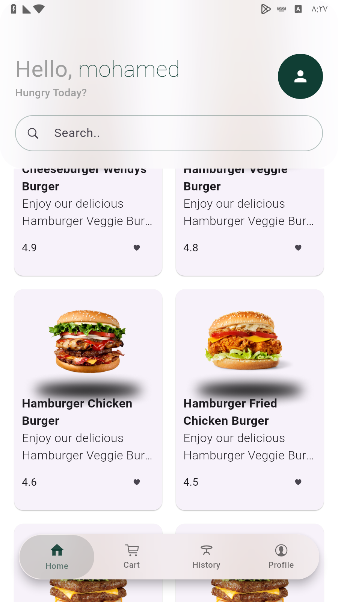
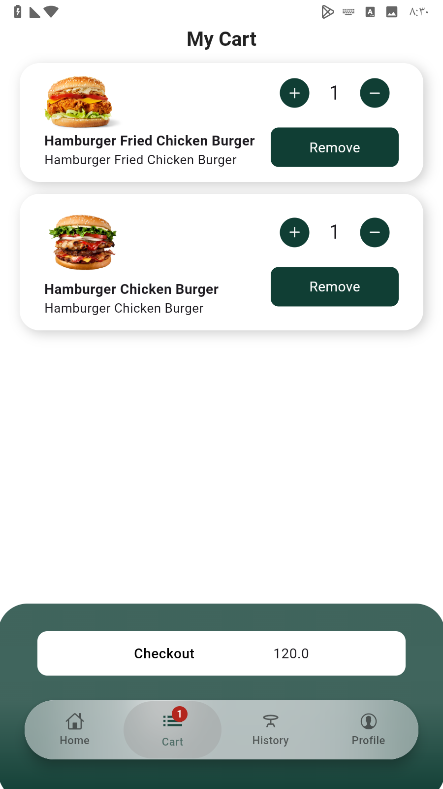
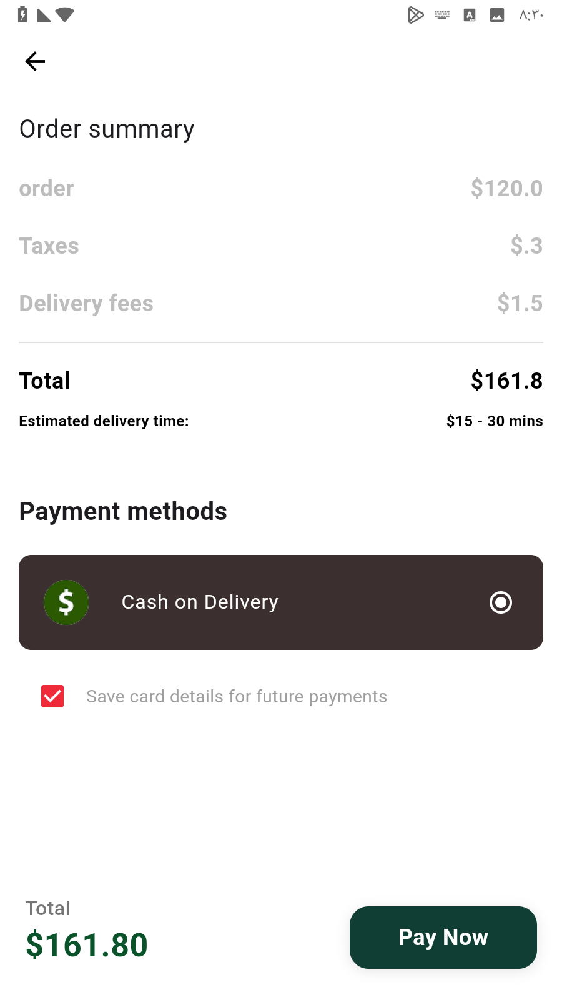

# HungryAPP

**HungryAPP** is a Flutter mobile application that allows users to browse, select, and order food easily. It integrates **Dio** for API communication and **Stripe** for secure payments, following modern Flutter development practices and clean architecture principles.

---

## Features

- Browse food categories and items  
- Add items to cart and view total  
- Online payment using Stripe  
- Responsive UI for all screen sizes  
- API-driven content fetching  

---

## Technologies & Packages Used

- **Flutter & Dart** – Mobile app development  
- **Dio** – HTTP client for API requests  
- **Provider / Riverpod** – State management  
- **Shared Preferences** – Local data storage  
- **Flutter ScreenUtil** – Responsive UI  
- **CachedNetworkImage** – Efficient image caching  
- **Flutter Stripe SDK** – Secure payments  

---

## Screenshots

| Home Screen | Cart & Checkout | Payment Screen |
|------------|----------------|----------------|
|  |  |  |
---

## Workflow Diagram

